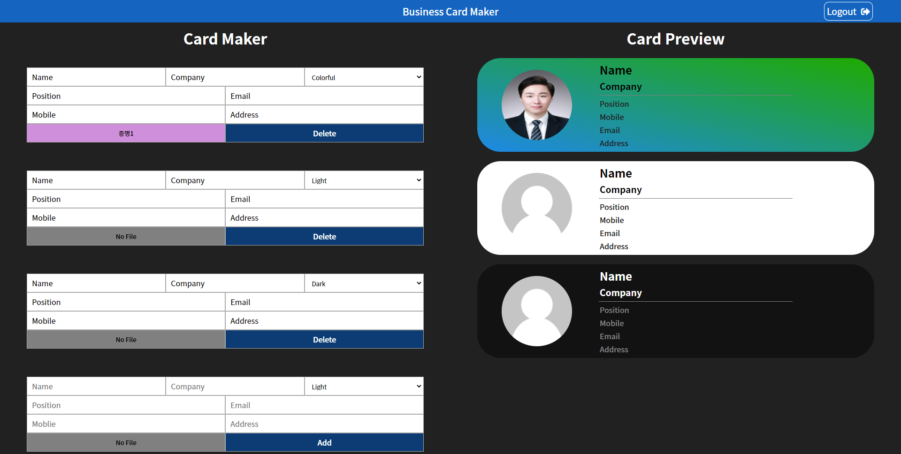

# Card-Maker

## 기능

 

### 1. Firebase Auth 로그인 기능

### [`auth_service.js`](./src/service/auth_service.js)

### [`firebase.js`](./src/service/firebase.js)

 

### 2. Firebase Realtime Database 연동

### [`card_repository.js`](./src/service/card_repository.js)

 

### 3. Img 업로드시 Cloudinary에 Img 저장

### [`image_uploader.js`](./src/service/image_uploader.js)

  

## ScreenShot

